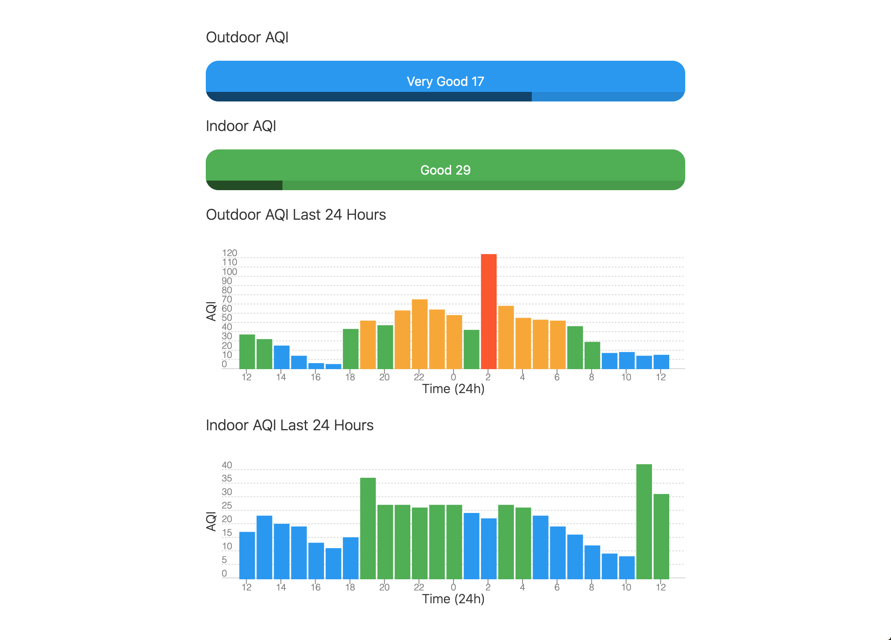

# Air Quality
Live Demo:  
[https://air.sebastianboyd.com/](https://air.sebastianboyd.com/)  

## Software Overview
- Svelte JS Based Web UI
- Python Backend using FastAPI framework
- PostgreSQL database
- C++ Embedded code using Arduio Libraries
- Hosted on a Google Cloud VM

## Parts List
- ESP8266 (NodeMCU V3 Module)
- Plantower PMS 7003 particle sensor
- AHT10 humidity and temperature sensor
- 5v power supply

Since some user's internet connections are slow and unreliable, I worked on minimizing the network transfer when loading the web ui. It is less than 25 kB on first load and 4kB after the page is cached.